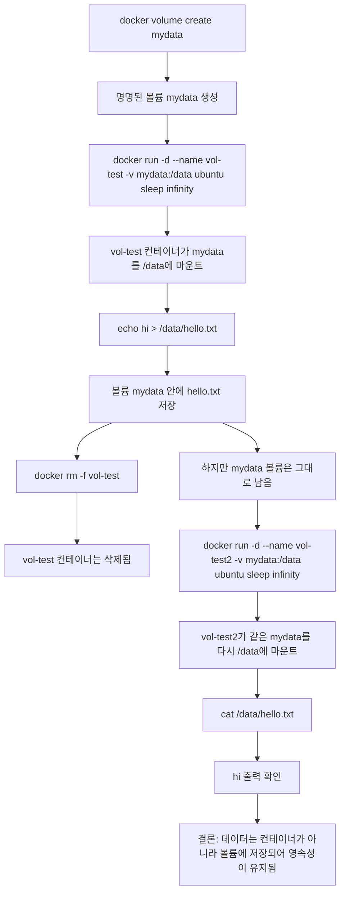

# AI/SW 개발 워크스테이션 구축

---

## 1. 실행 환경

```bash
$ pwd
/Users/jay7math2050/Desktop/workspace/e1-1
$ docker info
jay7math2050@c3r3s7 e1-1 % docker info
Client:
 Version:    28.5.2
 Context:    orbstack
 Debug Mode: false
 Plugins:
  buildx: Docker Buildx (Docker Inc.)
    Version:  v0.29.1
    Path:     /Users/jay7math2050/.docker/cli-plugins/docker-buildx
  compose: Docker Compose (Docker Inc.)
    Version:  v2.40.3
    Path:     /Users/jay7math2050/.docker/cli-plugins/docker-compose

Server:
 Containers: 0
  Running: 0
  Paused: 0
  Stopped: 0
 Images: 0
 Server Version: 28.5.2
 Storage Driver: overlay2
  Backing Filesystem: btrfs
  Supports d_type: true
  Using metacopy: false
  Native Overlay Diff: true
  userxattr: false
 Logging Driver: json-file
 Cgroup Driver: cgroupfs
 Cgroup Version: 2
 Plugins:
  Volume: local
  Network: bridge host ipvlan macvlan null overlay
  Log: awslogs fluentd gcplogs gelf journald json-file local splunk syslog
 CDI spec directories:
  /etc/cdi
  /var/run/cdi
 Swarm: inactive
 Runtimes: io.containerd.runc.v2 runc
 Default Runtime: runc
 Init Binary: docker-init
 containerd version: 1c4457e00facac03ce1d75f7b6777a7a851e5c41
 runc version: d842d7719497cc3b774fd71620278ac9e17710e0
 init version: de40ad0
 Security Options:
  seccomp
   Profile: builtin
  cgroupns
 Kernel Version: 6.17.8-orbstack-00308-g8f9c941121b1
 Operating System: OrbStack
 OSType: linux
 Architecture: x86_64
 CPUs: 6
 Total Memory: 15.67GiB
 Name: orbstack
 ID: ae81d9ed-197f-4665-bb14-bd1366785c2f
 Docker Root Dir: /var/lib/docker
 Debug Mode: false
 Experimental: false
 Insecure Registries:
  ::1/128
  127.0.0.0/8
 Live Restore Enabled: false
 Product License: Community Engine
 Default Address Pools:
   Base: 192.168.97.0/24, Size: 24
 ...
   Base: fd07:b51a:cc66:d000::/56, Size: 64

WARNING: DOCKER_INSECURE_NO_IPTABLES_RAW is set
$ docker --version
Docker version 28.5.2, build ecc6942 
$ git --version
git version 2.53.0
```

명령어 설명:

| 명령어 | 설명 | 확인/의미 |
| --- | --- | --- |
| `pwd` | 현재 작업 중인 디렉터리의 절대 경로를 출력하는 명령 | `<기본 개발 디렉토리>/dev-workstation-setup` 는 과제를 수행한 저장소 루트 위치를 의미 
| `docker --version` | Docker CLI 설치 여부와 버전을 확인하는 명령 | `Docker version 28.5.2` 이므로 Docker 명령어가 정상 설치되어 있고 버전은 `28.5.2` (사용자 Docker 버전에 맞게 수정) |
| `docker info` | 실제 Docker 엔진이 동작 중인지, 컨텍스트와 스토리지 드라이버 등을 확인하는 점검 명령 | `Context: orbstack` 은 Docker 환경 연결, `Server Version: 28.5.2` 는 Docker 데몬이 실제 동작 중임을 의미 (사용자 환경에 맞게 수정) |
| `git --version` | Git 설치 여부와 버전을 확인하는 명령 | `git version 2.53.0` 이므로 Git 버전은 `2.53.0` (사용자 Git 버전에 맞게 수정) |

---

## 2. 터미널 기본 조작

```bash
$ cd /Users/jay7math2050/Desktop/workspace/e1-1

$ pwd
/Users/jay7math2050/Desktop/workspace/e1-1

$ ls -la
total 96
drwxr-xr-x  10 jay7math2050  jay7math2050    320 Apr  4 18:15 .
drwxr-xr-x   3 jay7math2050  jay7math2050     96 Apr  4 18:01 ..
-rw-r--r--   1 jay7math2050  jay7math2050    136 Apr  4 17:49 .dockerignore
drwxr-xr-x  10 jay7math2050  jay7math2050    320 Apr  4 17:38 .git
-rw-r--r--   1 jay7math2050  jay7math2050    244 Apr  4 17:49 .gitignore
drwxr-xr-x   3 jay7math2050  jay7math2050     96 Apr  4 17:49 app
drwxr-xr-x   3 jay7math2050  jay7math2050     96 Apr  4 17:49 bonus
-rw-r--r--   1 jay7math2050  jay7math2050    131 Apr  4 17:49 Dockerfile
-rw-r--r--   1 jay7math2050  jay7math2050  34178 Apr  4 18:15 README.md
drwxr-xr-x   3 jay7math2050  jay7math2050     96 Apr  4 17:49 web

$ mkdir cli-lab

$ cd cli-lab

$ pwd
/Users/jay7math2050/Desktop/workspace/e1-1/cli-lab

$ ls -la
total 0
drwxr-xr-x   2 jay7math2050  jay7math2050   64 Apr  4 18:16 .
drwxr-xr-x  11 jay7math2050  jay7math2050  352 Apr  4 18:16 ..

$ touch empty.txt

$ echo "hello terminal" > memo.txt

$ cat memo.txt
hello terminal

$ cp memo.txt copy.txt

$ mv copy.txt renamed.txt

$ mkdir dir1

$ mv renamed.txt dir1/

$ cp -r dir1 dir1_backup

$ ls -la
total 8
drwxr-xr-x   6 jay7math2050  jay7math2050  192 Apr  4 18:17 .
drwxr-xr-x  11 jay7math2050  jay7math2050  352 Apr  4 18:16 ..
drwxr-xr-x   3 jay7math2050  jay7math2050   96 Apr  4 18:17 dir1
drwxr-xr-x   3 jay7math2050  jay7math2050   96 Apr  4 18:17 dir1_backup
-rw-r--r--   1 jay7math2050  jay7math2050    0 Apr  4 18:16 empty.txt
-rw-r--r--   1 jay7math2050  jay7math2050   15 Apr  4 18:16 memo.txt

$ rm empty.txt

$ rm -rf dir1_backup

$ ls -la
total 8
drwxr-xr-x   4 jay7math2050  jay7math2050  128 Apr  4 18:18 .
drwxr-xr-x  11 jay7math2050  jay7math2050  352 Apr  4 18:16 ..
drwxr-xr-x   3 jay7math2050  jay7math2050   96 Apr  4 18:17 dir1
-rw-r--r--   1 jay7math2050  jay7math2050   15 Apr  4 18:16 memo.txt
```

명령어 설명:

| 명령어 | 설명 | 결과/의미 |
| --- | --- | --- |
| `cd /Users/jay7math2050/Desktop/workspace/e1-1` | 실습 시작 위치를 `e1-1` 디렉터리로 이동하는 명령 | 과제용 실습 공간으로 진입 (사용자 환경에 맞게 수정) |
| `pwd` | 현재 작업 디렉터리의 절대 경로를 확인하는 명령 | 현재 위치가 `/Users/jay7math2050/Desktop/workspace/e1-1` 임을 확인 (사용자 환경에 맞게 수정) |
| `ls -la` | 숨김 파일을 포함한 현재 디렉터리 목록을 자세히 보는 명령 | `practice` 아래에 어떤 디렉터리가 있는지 확인 |
| `mkdir cli-lab` | `cli-lab` 이라는 새 디렉터리를 생성하는 명령 | 실습용 새 폴더 생성 |
| `cd cli-lab` | 방금 만든 `cli-lab` 디렉터리로 이동하는 명령 | 실습 폴더 내부로 진입 |
| `pwd` | 현재 작업 디렉터리의 절대 경로를 다시 확인하는 명령 | 현재 위치가 `/Users/jay7math2050/Desktop/workspace/e1-1/cli-lab` 임을 확인 (사용자 환경에 맞게 수정) |
| `ls -la` | 현재 디렉터리 안의 파일 목록을 확인하는 명령 | 새로 만든 폴더라서 비어 있는 상태임을 확인 |
| `touch empty.txt` | 빈 파일 `empty.txt` 를 생성하는 명령 | 내용 없는 빈 파일 1개 생성 |
| `echo "hello terminal" > memo.txt` | 문자열을 `memo.txt` 파일에 저장하는 명령 | `memo.txt` 파일 생성 및 내용 기록 |
| `cat memo.txt` | 파일 내용을 터미널에 출력하는 명령 | `hello terminal` 이 출력되어 저장이 정상적으로 되었음을 확인 |
| `cp memo.txt copy.txt` | `memo.txt` 를 `copy.txt` 라는 이름으로 복사하는 명령 | 파일 복사본 생성 |
| `mv copy.txt renamed.txt` | `copy.txt` 의 이름을 `renamed.txt` 로 변경하는 명령 | 복사본 파일 이름 변경 |
| `mkdir dir1` | `dir1` 디렉터리를 생성하는 명령 | 파일을 옮겨 넣을 폴더 생성 |
| `mv renamed.txt dir1/` | `renamed.txt` 를 `dir1` 안으로 이동하는 명령 | 파일 이동 수행 |
| `cp -r dir1 dir1_backup` | `dir1` 디렉터리를 하위 내용까지 포함하여 복사하는 명령 | `dir1_backup` 백업 디렉터리 생성 |
| `ls -la` | 현재 디렉터리의 변경된 목록을 다시 확인하는 명령 | `dir1`, `dir1_backup`, `empty.txt`, `memo.txt` 가 생성된 상태를 확인 |
| `rm empty.txt` | `empty.txt` 파일을 삭제하는 명령 | 불필요한 빈 파일 삭제 |
| `rm -rf dir1_backup` | `dir1_backup` 디렉터리와 내부 내용을 강제로 삭제하는 명령 | 백업 디렉터리 전체 삭제 |
| `ls -la` | 최종 상태를 확인하는 명령 | `dir1` 과 `memo.txt` 만 남아 있는 상태를 확인 |

---

## 3. 권한 실습

```bash
$ cd /Users/jay7math2050/Desktop/workspace/e1-1/cli-lab

$ touch perm.txt

$ mkdir perm_dir

$ mv perm.txt perm_dir/

$ ls -l perm_file.txt
total 0
-rw-r--r--  1 jay7math2050  jay7math2050  0 Apr  4 18:19 perm.txt

$ ls -ld perm_dir
drwxr-xr-x  3 jay7math2050  jay7math2050  96 Apr  4 18:20 perm_dir

$ chmod 600 perm.txt

$ cd ..

$ chmod 700 perm_dir

$ cd perm_dir

$ ls -l perm_file.txt
-rw-------  1 jay7math2050  jay7math2050  0 Apr  4 18:19 perm.txt

$ cd ..

$ ls -ld perm_dir
drwx------ 3 jay7math2050  jay7math2050  96 Apr  4 18:20 perm_dir

$ chmod 644 perm_file.txt

$ chmod 755 perm_dir

$ ls -l perm_file.txt
-rw-r--r--  1 c10hour0574  c10hour0574  0 Apr  4 18:19 perm.txt

$ ls -ld perm_dir
drwxr-xr-x  2 c10hour0574  jay7math2050  96 Apr  4 18:20 perm_dir
```

1. `touch perm_file.txt`, `mkdir perm_dir`
파일 1개와 디렉터리 1개를 만들어 권한 실습 대상물을 준비하는 단계다. 이번 실습에서는 `perm_file.txt` 와 `perm_dir` 를 같은 위치에서 비교했다.

2. `ls -l perm_file.txt`, `ls -ld perm_dir`
권한 변경 전 상태를 확인하는 명령이다. 일반 파일은 `-rw-r--r--`, 디렉터리는 `drwxr-xr-x` 로 시작하는데, 맨 앞 문자는 각각 파일(`-`)과 디렉터리(`d`) 타입을 의미한다.

3. `chmod 600 perm_file.txt`, `chmod 700 perm_dir`
파일은 소유자만 읽기/쓰기 가능하도록 `600` 으로 바꾸고, 디렉터리는 소유자만 읽기/쓰기/진입 가능하도록 `700` 으로 바꾼다. 이후 `ls` 결과에서 파일은 `-rw-------`, 디렉터리는 `drwx------` 로 바뀐 것을 확인할 수 있다.

4. `chmod 644 perm_file.txt`, `chmod 755 perm_dir`
마지막으로 파일은 일반적인 읽기 중심 권한인 `644`, 디렉터리는 읽기/진입이 가능한 `755` 로 되돌린다. 변경 후 결과는 각각 `-rw-r--r--`, `drwxr-xr-x` 이다.

권한 숫자 해석:

- `r` 는 읽기, `w` 는 쓰기, `x` 는 실행 또는 디렉터리 진입 권한이다.
- `r = 4`, `w = 2`, `x = 1`
- 세 자리 숫자는 `소유자/그룹/기타 사용자` 순서다.
- `644 = rw- r-- r--`
- `755 = rwx r-x r-x`
- `644` 는 소유자는 읽기/쓰기, 그룹과 기타 사용자는 읽기만 가능하다는 뜻이다.
- `755` 는 소유자는 읽기/쓰기/진입이 가능하고, 그룹과 기타 사용자는 읽기와 진입만 가능하다는 뜻이다.

---

## 4. Docker 설치 및 기본 점검

```bash
$ docker --version
Docker version 28.5.2, build ecc6942 

$ docker info
Client:
 Version:    28.5.2
 Context:    orbstack
 Debug Mode: true
 Plugins:
  buildx: Docker Buildx (Docker Inc.)
    Version:  v0.29.1
  compose: Docker Compose (Docker Inc.)
    Version:  v2.40.3

Server:
 Containers: 1
  Running: 0
  Paused: 0
  Stopped: 1
 Images: 12
 Server Version: 28.5.2
 Storage Driver: overlay2
 Operating System: orbstack
 OSType: linux
 Architecture: x86_64 

$ docker images

$ docker ps
CONTAINER ID   IMAGE     COMMAND   CREATED   STATUS    PORTS     NAMES

$ docker ps -a

$ docker run --name hello-test hello-world

Hello from Docker!
This message shows that your installation appears to be working correctly.

$ docker logs hello-test

Hello from Docker!
This message shows that your installation appears to be working correctly.
```

명령어 설명:

1. `docker --version`
Docker CLI 가 설치되어 있는지와 버전이 무엇인지 확인하는 명령이다. 출력값 `28.5.2` 는 현재 사용한 Docker 명령어 버전을 의미한다. (사용자 Docker 버전에 맞게 수정)

2. `docker info`
1번 실행 환경에서 확인한 Docker 정보를 동일하게 다시 확인할 수 있는 명령이다.

3. `docker images`
현재 로컬에 저장된 이미지 목록을 확인하는 명령이다. 여기서 `hello-world`, `ubuntu:24.04`, `nginx:1.29-alpine`, `workstation-web` 이미지가 준비되어 있음을 확인할 수 있다.

4. `docker ps`
현재 실행 중인 컨테이너 목록을 확인하는 명령이다. 출력이 비어 있으므로 조회 시점에는 실행 중인 컨테이너가 없었다.

5. `docker ps -a`
종료된 컨테이너까지 포함한 전체 목록을 확인하는 명령이다. 이번 출력에서는 `orbstack-web-lab` 처럼 이미 생성되었다가 종료된 컨테이너도 함께 조회된다. (사용자 환경에 맞게 수정)

6. `docker run --name hello-test hello-world`
가장 기본적인 Docker 동작 검증 명령이다. `Hello from Docker!` 문구가 출력되면, Docker 클라이언트가 데몬과 통신하고, 이미지를 실행해 컨테이너를 정상적으로 생성했다는 뜻이다. (사용자 환경에 맞게 수정)

7. `docker logs hello-test`
이미 실행이 끝난 `hello-test` 컨테이너의 로그를 다시 확인하는 명령이다. 여기서도 같은 `Hello from Docker!` 문구가 보이므로, 컨테이너 출력이 정상적으로 저장되었음을 확인할 수 있다.

---

## 5. 컨테이너 실행 실습

### 5-1. `ubuntu` 컨테이너로 `attach` / `exec` 차이를 직접 본다

```bash
$ docker run -dit --name ubuntu-lab ubuntu bash
b432c2e426ae740df4fe604cffd27f4f1035e7fade8b893dc45cfff54b8fc083

$ docker attach ubuntu-lab
root@b432c2e426ae:/# ls
bin   boot  dev  etc  home  lib  lib64  media  mnt  opt  proc  root  run  sbin  srv  sys  tmp  usr  var
root@b432c2e426ae:/# echo "attach mode" > /tmp/attach.txt
root@b432c2e426ae:/# cat /tmp/attach.txt
attach mode
root@b432c2e426ae:/# Ctrl + P, Ctrl + Q

$ docker exec -it ubuntu-lab bash
root@b432c2e426ae:/# cat /tmp/attach.txt
attach mode
root@b432c2e426ae:/# echo "exec mode" > /tmp/exec.txt
root@b432c2e426ae:/# cat /tmp/exec.txt
exec mode
root@b432c2e426ae:/# exit
exit

$ docker ps --filter name=ubuntu-lab
CONTAINER ID   IMAGE     COMMAND   CREATED          STATUS          PORTS     NAMES
b432c2e426ae   ubuntu    "bash"    19 seconds ago   Up 18 seconds             ubuntu-lab

$ docker ps -a --filter name=ubuntu-lab
CONTAINER ID   IMAGE     COMMAND   CREATED          STATUS          PORTS     NAMES
b432c2e426ae   ubuntu    "bash"    19 seconds ago   Up 18 seconds             ubuntu-lab
```

명령어 설명:

1. `docker run -dit --name ubuntu-lab ubuntu bash`
   `ubuntu` 이미지를 기반으로 `bash` 를 메인 프로세스로 실행하는 컨테이너를 만든다. `-d` 는 백그라운드 실행, `-i` 는 표준입력 유지, `-t` 는 터미널 할당을 의미한다. 출력으로 나온 긴 문자열은 새 컨테이너 ID 다.

<p><strong>[attach]</strong></p>

2. `docker attach ubuntu-lab`
   이미 실행 중인 컨테이너의 메인 `bash` 프로세스에 직접 붙는다. 프롬프트가 `root@b432c2e426ae:/#` 로 바뀌는 것은 "호스트 셸" 이 아니라 "컨테이너 안의 셸" 로 들어갔다는 뜻이다.
3. `ls`
   컨테이너 루트 디렉터리의 기본 폴더 목록을 본다. `bin`, `boot`, `etc`, `tmp`, `usr` 같은 표준 리눅스 디렉터리가 보이면 Ubuntu 컨테이너 내부 파일시스템을 보고 있다는 뜻이다.
4. `echo "attach mode" > /tmp/attach.txt` 와 `cat /tmp/attach.txt`
   `attach` 상태에서 파일을 직접 만들고, 곧바로 내용을 읽어 출력했다. `attach mode` 가 그대로 보이므로 컨테이너 안에서 파일 쓰기와 읽기가 정상 동작함을 확인할 수 있다.
5. `Ctrl + P`, `Ctrl + Q` (동시에 누르는 것이 아니라, `Ctrl + P` 다음 `Ctrl + Q` 를 순서대로 입력한다)
   `exit` 하지 않고 연결만 끊는 분리(detach) 키다. 이 방식으로 나오면 메인 `bash` 프로세스가 계속 살아 있으므로 컨테이너도 유지된다.
<br>
<p><strong>[exec]</strong></p>

6. `docker exec -it ubuntu-lab bash`
   이미 실행 중인 같은 컨테이너 안에서 "새로운 셸 프로세스" 를 추가로 띄운다. 즉, 메인 프로세스에 직접 붙는 `attach` 와 달리, `exec` 는 별도 작업 창을 하나 더 여는 개념이다.
7. `cat /tmp/attach.txt`
   앞서 `attach` 단계에서 만든 파일이 그대로 보인다. 출력이 `attach mode` 인 것은 두 작업이 같은 컨테이너 파일시스템을 공유한다는 뜻이다.
8. `echo "exec mode" > /tmp/exec.txt` 와 `cat /tmp/exec.txt`
   이번에는 `exec` 셸 안에서 새 파일을 만들고 읽었다. `exec mode` 출력으로 새 프로세스에서도 컨테이너 내부 작업이 가능함을 확인했다.
9. `exit`
   `exec` 로 연 셸만 종료한다. 메인 `bash` 는 아직 살아 있으므로 컨테이너 전체는 종료되지 않는다.
10. `docker ps`, `docker ps -a`
    두 명령 모두 `ubuntu-lab` 이 `Up` 상태로 보였다. 현재 실행 중인 컨테이너이기 때문에 `ps` 와 `ps -a` 양쪽에 모두 나타난다.

한 줄 정리:

- `attach`: 메인 프로세스에 직접 붙음
- `exec`: 실행 중인 컨테이너 안에서 새 프로세스를 띄움

---


## 5-2. OrbSTack 추가 실습: 컨테이너 0개 상태에서 새 컨테이너 만들기

```bash
$ docker ps -a
CONTAINER ID   IMAGE                 COMMAND                  CREATED          STATUS          PORTS                                     NAMES
12b84f68d907   workstation-web:1.0   "/docker-entrypoint.…"   6 seconds ago    Up 6 seconds    0.0.0.0:8088->80/tcp, [::]:8088->80/tcp   mission-web
b432c2e426ae   ubuntu                "bash"                   41 seconds ago   Up 40 seconds                                             ubuntu-lab

$ docker create --name orbstack-web-lab -p 8092:80 workstation-web:1.0
37143dcd2f2b6d8bfdbddca7cdcee693405c0c67e72c81f29c6b337e2f6b5f3a

$ docker ps -a --filter name=orbstack-web-lab
CONTAINER ID   IMAGE                 COMMAND                  CREATED        STATUS    PORTS     NAMES
37143dcd2f2b   workstation-web:1.0   "/docker-entrypoint.…"   1 second ago   Created             orbstack-web-lab

$ docker start orbstack-web-lab
orbstack-web-lab

$ docker ps --filter name=orbstack-web-lab
CONTAINER ID   IMAGE                 COMMAND                  CREATED        STATUS                  PORTS                                     NAMES
37143dcd2f2b   workstation-web:1.0   "/docker-entrypoint.…"   1 second ago   Up Less than a second   0.0.0.0:8092->80/tcp, [::]:8092->80/tcp   orbstack-web-lab

$ curl -s http://localhost:8092
<h1>Hello Web Server</h1>

$ docker stop orbstack-web-lab
orbstack-web-lab
```

## 6. 웹 서버 소스 작성, Dockerfile 작성, 이미지 빌드, 포트 매핑 실행

`Dockerfile`:

```dockerfile
FROM nginx:alpine
LABEL org.opencontainers.image.title="my-custom-nginx"
ENV APP_ENV=dev
COPY web/ /usr/share/nginx/html/
EXPOSE 80
```

Dockerfile 설명:

1. `FROM nginx:alpine`
   `nginx:alpine` 이미지를 베이스로 사용한다. 입력은 "가벼운 NGINX 웹 서버 이미지를 기반으로 삼겠다"는 뜻이고, 결과적으로 직접 웹 서버를 처음부터 설치하지 않아도 정적 페이지를 빠르게 띄울 수 있다.
2. `LABEL org.opencontainers.image.title="my-custom-nginx"`
   이미지에 식별용 메타데이터를 붙인다. 입력은 이미지 제목 정보이고, 출력은 터미널에 직접 보이지 않더라도 이미지 관리 도구에서 어떤 용도의 이미지인지 구분하는 데 도움이 된다.
3. `ENV APP_ENV=dev`
   컨테이너 내부 기본 환경변수를 설정한다. 입력은 `APP_ENV` 값을 `dev` 로 두겠다는 뜻이고, 이 값은 이후 컨테이너 안에서 설정값처럼 읽어 쓸 수 있다.
4. `COPY web/ /usr/share/nginx/html/`
   호스트의 `web/` 디렉터리 내용을 NGINX 기본 웹 루트로 복사한다. 입력은 우리가 만든 웹 파일들이고, 출력은 컨테이너가 실행될 때 그 파일을 바로 서비스할 수 있는 상태가 된다.
5. `EXPOSE 80`
   컨테이너가 기본적으로 사용하는 웹 포트가 `80` 임을 문서처럼 명시한다. 입력은 포트 번호 선언이고, 실제 외부 접속은 이후 `docker run -p 8088:80 ...` 처럼 포트 매핑했을 때 가능해진다.

명령 실행:

```bash
$ mkdir -p web

$ echo '<h1>Hello Web Server</h1>' > web/index.html

$ docker build -t workstation-web:1.0 .
...
#7 naming to docker.io/library/workstation-web:1.0

$ docker images
REPOSITORY        TAG       IMAGE ID       CREATED        SIZE
workstation-web   1.0       16db8f7dbc40   1 second ago   62.2MB
hello-world       latest    e2ac70e7319a   11 days ago    10.1kB
ubuntu            latest    f794f40ddfff   5 weeks ago    78.1MB

$ docker run -d --name mission-web -p 8088:80 workstation-web:1.0 
12b84f68d9070fac0c9b6f9e8255bdcc09822dbd58789bb94c722daec85ae813

$ docker ps --filter name=mission-web
CONTAINER ID   IMAGE                 COMMAND                  CREATED        STATUS                  PORTS                                     NAMES
12b84f68d907   workstation-web:1.0   "/docker-entrypoint.…"   1 second ago   Up Less than a second   0.0.0.0:8088->80/tcp, [::]:8088->80/tcp   mission-web

$ docker logs mission-web | sed -n '1,8p'
/docker-entrypoint.sh: /docker-entrypoint.d/ is not empty, will attempt to perform configuration
/docker-entrypoint.sh: Looking for shell scripts in /docker-entrypoint.d/
/docker-entrypoint.sh: Launching /docker-entrypoint.d/10-listen-on-ipv6-by-default.sh
10-listen-on-ipv6-by-default.sh: info: Getting the checksum of /etc/nginx/conf.d/default.conf
10-listen-on-ipv6-by-default.sh: info: Enabled listen on IPv6 in /etc/nginx/conf.d/default.conf
/docker-entrypoint.sh: Sourcing /docker-entrypoint.d/15-local-resolvers.envsh
/docker-entrypoint.sh: Launching /docker-entrypoint.d/20-envsubst-on-templates.sh
/docker-entrypoint.sh: Launching /docker-entrypoint.d/30-tune-worker-processes.sh

$ curl -s http://localhost:8088
<h1>Hello Web Server</h1>
```

명령 설명:

1. `mkdir -p web`
   웹 소스 폴더를 만드는 입력이다. 출력은 따로 없지만, 이후 `web/index.html` 파일을 안전하게 만들 수 있는 디렉터리가 준비된다.
2. `echo '<h1>Hello Web Server</h1>' > web/index.html`
   가장 단순한 HTML 본문을 파일로 저장하는 입력이다. 출력은 따로 없고, 결과로 `web/index.html` 안에 `Hello Web Server` 문구가 들어간다.
3. `docker build -t workstation-web:1.0 .`
   현재 디렉터리의 `Dockerfile` 과 build context를 사용해 이미지를 만드는 입력이다. 출력 중 `naming to docker.io/library/workstation-web:1.0` 가 보이면 `workstation-web:1.0` 이름의 이미지가 정상 생성되었다는 뜻이다.
4. `docker images`
   로컬 이미지 목록을 확인하는 입력이다. 출력에서 `workstation-web   1.0` 이 보이므로 방금 빌드한 커스텀 이미지가 실제로 저장되었음을 확인할 수 있다.
5. `docker run -d --name mission-web -p 8088:80 workstation-web:1.0`
   방금 만든 이미지를 백그라운드 컨테이너로 실행하는 입력이다. 출력으로 긴 컨테이너 ID 가 나오면 생성과 시작이 정상 처리된 것이다. `-p 8088:80` 은 호스트 8088 포트를 컨테이너 80 포트에 연결한다는 의미다. (포트 8088은 다른 포트와 겹치지 않도록 주의하십시오.)
6. `docker ps`
   현재 실행 중인 컨테이너를 확인하는 입력이다. 출력에서 `mission-web` 이 `Up` 상태로 보이고 `0.0.0.0:8088->80/tcp` 가 함께 보이므로, 컨테이너가 실행 중이며 브라우저에서 `localhost:8088` 로 접근할 수 있음을 뜻한다.
7. `docker logs mission-web | sed -n '1,8p'`
   컨테이너 시작 로그 일부를 확인하는 입력이다. 출력에 `/docker-entrypoint.sh` 와 NGINX 초기화 관련 문장이 보이므로, NGINX가 정상적으로 기동 과정을 수행했음을 확인할 수 있다.
8. `curl -s http://localhost:8088`
   브라우저 대신 터미널에서 HTTP 응답을 검증하는 입력이다. 출력으로 `<h1>Hello Web Server</h1>` 가 그대로 보였기 때문에, 포트 매핑된 웹 서버가 우리가 만든 페이지를 정상 응답하고 있다는 뜻이다.

---

## 7. 바인드 마운트 반영 검증

```bash
$ mkdir -p bind-site

$ echo '<h1>Bind Mount Version 1</h1>' > bind-site/index.html

$ docker run -d --name bind-web -p 8081:80 -v "$(pwd)/bind-site:/usr/share/nginx/html" nginx:alpine
e5a3a425dad2e4cca8ace417e8b74b9a1c6b44c97dcdd76fe1818b33116e0fb9

$ curl -s http://localhost:8081
<h1>Bind Mount Version 1</h1>

$ echo '<h1>Bind Mount Version 2</h1>' > bind-site/index.html

$ curl -s http://localhost:8081
<h1>Bind Mount Version 2</h1>
```

명령줄 설명:

1. `mkdir -p bind-site`
   바인드 마운트 실험용 디렉터리를 호스트에 만드는 명령이다. 이 폴더가 이후 컨테이너의 `/usr/share/nginx/html` 과 직접 연결된다.

2. `echo '<h1>Bind Mount Version 1</h1>' > bind-site/index.html`
   호스트 쪽 HTML 파일의 첫 번째 버전을 만든다. 이 파일은 이미지에 복사되는 것이 아니라, 컨테이너 실행 시 실시간으로 연결될 원본 파일이다.

3. `docker run -d --name bind-web -p 8081:80 -v "$(pwd)/bind-site:/usr/share/nginx/html" nginx:alpine`
   `nginx:alpine` 컨테이너를 실행하면서 호스트의 `bind-site` 디렉터리를 컨테이너 웹 루트에 바인드 마운트하는 명령이다. `-v` 옵션 때문에 컨테이너는 자기 내부 파일 대신 호스트 디렉터리 내용을 바로 읽게 된다. (포트 8081은 다른 포트와 겹치지 않도록 주의하십시오.)

4. `curl -s http://localhost:8081`
   수정 전 웹 응답을 확인하는 명령이다. 출력에 `Bind Mount Version 1` 이 보이므로, 호스트 파일의 첫 번째 버전이 컨테이너 웹 서버를 통해 정상 제공되고 있다는 뜻이다.

5. `echo '<h1>Bind Mount Version 2</h1>' > bind-site/index.html`
   이번에는 이미 실행 중인 컨테이너를 건드리지 않고, 호스트 파일만 두 번째 버전으로 덮어쓴다. 이 단계가 바인드 마운트 검증의 핵심이다.

6. `curl -s http://localhost:8081`
   수정 후 웹 응답을 다시 확인하는 명령이다. 출력이 바로 `Bind Mount Version 2` 로 바뀌었으므로, 이미지를 다시 빌드하거나 컨테이너를 다시 만들지 않아도 호스트 변경 사항이 즉시 반영된다는 것을 확인할 수 있다.

의미 정리:

- 바인드 마운트는 호스트 디렉터리와 컨테이너 경로를 직접 연결한다.
- 그래서 호스트 파일을 수정하면 이미 실행 중인 컨테이너도 새 파일 내용을 즉시 읽는다.
- 개발 중 "코드를 고치고 바로 반영 보기" 에 특히 유용하다.

---

## 8. Docker 볼륨 영속성 검증

생성 명령:

```bash
$ docker volume create mydata
mydata

$ docker volume ls
DRIVER    VOLUME NAME
local     mydata
```

첫 컨테이너에서 파일 생성:

```bash
$ docker run -d --name vol-test -v mydata:/data ubuntu sleep infinity
b26af678c220673894e71e62a26f3b2c84259cff0a1611f07212bb8b253c7311

$ docker exec -it vol-test bash -lc 'echo hi > /data/hello.txt && cat /data/hello.txt'
hi
```

컨테이너 삭제:

```bash
$ docker rm -f vol-test
vol-test
```

새 컨테이너에서 같은 파일 확인:

```bash
$ docker run -d --name vol-test2 -v mydata:/data ubuntu sleep infinity
104e2e954c9329b582d7a44f5ebfc36e8b863703a0f5b93e8a4883749aa59169

$ docker exec -it vol-test2 bash -lc 'cat /data/hello.txt'
hi
```

의미 정리:

- `docker volume create mydata` 는 컨테이너 밖에 남는 별도 저장공간을 만든다.
- 첫 번째 컨테이너 `vol-test` 안에서 `/data/hello.txt` 를 만들고 `hi` 를 저장했다.
- `docker rm -f vol-test` 로 첫 컨테이너를 삭제했지만, 볼륨 `mydata` 자체는 삭제되지 않는다.
- 두 번째 컨테이너 `vol-test2` 를 같은 볼륨에 다시 연결했을 때도 `cat /data/hello.txt` 결과가 `hi` 로 그대로 보였으므로, 데이터가 컨테이너가 아니라 볼륨에 남아 있었다는 것을 확인할 수 있다.

다이어그램:



---

## 9. 운영 명령 검증

```bash
$ docker images
REPOSITORY        TAG       IMAGE ID       SIZE
workstation-web   1.0       16db8f7dbc40   62.2MB
nginx             alpine    d5030d429039   62.2MB
hello-world       latest    e2ac70e7319a   10.1kB
ubuntu            latest    f794f40ddfff   78.1MB
busybox           1.36      b116e1550744   4.42MB

$ docker ps -a
CONTAINER ID   IMAGE                 COMMAND                  CREATED              STATUS                          PORTS                                     NAMES
104e2e954c93   ubuntu                "sleep infinity"         52 seconds ago       Up 51 seconds                                                             vol-test2
e5a3a425dad2   nginx:alpine          "/docker-entrypoint.…"   About a minute ago   Up About a minute               0.0.0.0:8081->80/tcp, [::]:8081->80/tcp   bind-web
37143dcd2f2b   workstation-web:1.0   "/docker-entrypoint.…"   About a minute ago   Exited (0) About a minute ago                                             orbstack-web-lab
12b84f68d907   workstation-web:1.0   "/docker-entrypoint.…"   About a minute ago   Up About a minute               0.0.0.0:8088->80/tcp, [::]:8088->80/tcp   mission-web
b432c2e426ae   ubuntu                "bash"                   About a minute ago   Up About a minute                                                         ubuntu-lab

$ docker logs mission-web | tail -n 5
2026/04/04 09:47:43 [notice] 1#1: start worker processes
2026/04/04 09:47:43 [notice] 1#1: start worker process 30
2026/04/04 09:47:43 [notice] 1#1: start worker process 31
2026/04/04 09:47:43 [notice] 1#1: start worker process 32
2026/04/04 09:47:43 [notice] 1#1: start worker process 33

$ docker stats --no-stream mission-web
CONTAINER ID   NAME          CPU %     MEM USAGE / LIMIT     MEM %     NET I/O         BLOCK I/O        PIDS
12b84f68d907   mission-web   0.00%     4.953MiB / 15.67GiB   0.03%     1.88kB / 809B   4.1kB / 8.19kB   7
```

의미 정리:

- `docker images` 로 지금까지 실습에 사용한 커스텀 이미지, 베이스 이미지, 보너스용 이미지가 로컬에 남아 있는지 다시 확인했다.
- `docker ps -a` 로 웹 서버, 바인드 마운트, 볼륨 실습, Ubuntu 실습, <Docker_Setup_Context> 추가 실습 컨테이너까지 현재 상태를 한 번에 점검했다. (사용자 환경에 맞게 수정)
- `docker logs mission-web | tail -n 5` 로 NGINX 워커 프로세스가 정상적으로 기동되었음을 나타내는 로그 메시지를 확인했다.
- `docker stats --no-stream mission-web` 로 CPU, 메모리, 네트워크 I/O, 블록 I/O 를 한 번성으로 확인해 실행 중 컨테이너의 리소스 상태를 점검했다.

---

## 10. 보너스 1. Docker Compose 기초, 멀티 컨테이너, 운영 명령, 환경 변수 활용

이 섹션에서는 `docker-compose.yml`을 사용하여 복잡한 컨테이너 관리 루틴을 선언적으로 구축하고 자동화하는 과정을 실증합니다.

---

### 10-0. 실습 파일 준비

실습을 위해 아래 세 개의 파일을 `bonus/compose` 디렉터리 내에 준비했습니다.

`site/index.html` (웹 서버가 제공할 페이지)
```html
<h1>Compose Bonus</h1>
```

`.env` (초기 환경 변수)
```env
WEB_PORT=8082 # 사용자 환경에 맞게 수정
APP_MODE=dev
```

`docker-compose.yml` (문서화된 컨테이너 설정 파일)
```yaml
services:
  web:
    image: nginx:alpine
    ports:
      - "${WEB_PORT}:80"
    volumes:
      - ./site:/usr/share/nginx/html:ro
    environment:
      APP_MODE: ${APP_MODE}

  helper:
    image: busybox:1.36
    command: sh -c "while true; do echo helper-alive; sleep 30; done"
```

---

### 10-1. Docker Compose 기초
- **목표**: `docker-compose.yml`의 기본 구조를 학습하고, 단일 서비스를 Compose로 실행합니다.
- **실행 및 검증**:
  ```bash
  $ cd <기본 개발 디렉토리>/dev-workstation-setup/bonus/compose # 사용자 환경에 맞게 수정
  $ docker compose up -d web
   Network compose_default  Creating
   Network compose_default  Created
   Container compose-web-1  Creating
   Container compose-web-1  Created
   Container compose-web-1  Starting
   Container compose-web-1  Started

  $ curl -s http://localhost:8082
  <h1>Compose Bonus</h1>
  ```
  `docker compose up -d web` 명령으로 `docker-compose.yml`에 정의된 `web` 단일 컨테이너(nginx)를 백그라운드에서 실행했습니다. 브라우저에서 `localhost:8082`로 접속하여 `<h1>Compose Bonus</h1>` 응답이 반환됨을 확인했습니다. (포트 8082는 다른 포트와 겹치지 않도록 주의하십시오.)
- **배움 포인트**: 이미지, 포트 매핑, 볼륨 마운트, 환경 변수 등 컨테이너 실행에 필요한 방대한 옵션을 `docker-compose.yml` 하나의 파일로 기록했습니다. 이를 통해 터미널에서 실행될 명령어의 길이와 복잡도는 줄어들며, 언제 누가 실행하더라도 **"문서화된 실행 설정"** 덕분에 완벽하게 동일한 실행 환경을 재현하게 됩니다.

---

### 10-2. Docker Compose 멀티 컨테이너 (네트워크/서비스 디스커버리)
- **목표**: 웹 서버와 보조 서비스 컨테이너를 함께 실행해, 내부 네트워크 통신을 확인합니다.
- **실행 및 검증**:
  ```bash
  $ docker compose up -d
  helper Pulling 
   034d6572bf28 Pulling fs layer 
   034d6572bf28 Download complete 
   034d6572bf28 Pull complete 
   helper Pulled 
   Container compose-web-1  Running
   Container compose-helper-1  Creating
   Container compose-helper-1  Created
   Container compose-helper-1  Starting
   Container compose-helper-1  Started

  $ docker compose exec -T helper sh -lc 'wget -qO- http://web'
  <h1>Compose Bonus</h1>
  ```
  `up -d`를 통해 `web`과 `helper` 서비스 2개를 동시에 구동했습니다. 이후 `helper` 컨테이너 내부에서 임의의 IP 주소 대신 `http://web`이라는 "서비스 이름"만으로 요청을 보냈고, 성공적으로 웹 페이지 응답을 받아왔습니다.
- **배움 포인트**: 복수의 컨테이너를 Compose로 함께 띄우면, 자동으로 디폴트 네트워크가 형성되어 컨테이너들을 묶습니다. IP 주소가 계속 바뀌는 환경이라도, 각 컨테이너는 Docker 내장 DNS를 통해 서비스 이름(`web`)으로 서로의 주소를 알아내어(서비스 디스커버리) 안정적인 네트워크 통신을 유지합니다.

---

### 10-3. Compose 운영 명령어 습득
- **목표**: `up, down, ps, logs`를 사용해 상태 확인 루틴을 확립합니다.
- **실행 및 검증**:
  ```bash
  $ docker compose ps
  NAME               IMAGE          COMMAND                  SERVICE   CREATED         STATUS                  PORTS
  compose-helper-1   busybox:1.36   "sh -c 'while true; …"   helper    1 second ago    Up Less than a second   
  compose-web-1      nginx:alpine   "/docker-entrypoint.…"   web       5 seconds ago   Up 5 seconds            0.0.0.0:8082->80/tcp, [::]:8082->80/tcp
  
  $ docker compose logs web
  web-1  | /docker-entrypoint.sh: /docker-entrypoint.d/ is not empty, will attempt to perform configuration
  web-1  | /docker-entrypoint.sh: Looking for shell scripts in /docker-entrypoint.d/
  web-1  | /docker-entrypoint.sh: Launching /docker-entrypoint.d/10-listen-on-ipv6-by-default.sh
  web-1  | 10-listen-on-ipv6-by-default.sh: info: Getting the checksum of /etc/nginx/conf.d/default.conf
  web-1  | 10-listen-on-ipv6-by-default.sh: info: Enabled listen on IPv6 in /etc/nginx/conf.d/default.conf
  web-1  | /docker-entrypoint.sh: Sourcing /docker-entrypoint.d/15-local-resolvers.envsh
  web-1  | /docker-entrypoint.sh: Launching /docker-entrypoint.d/20-envsubst-on-templates.sh
  web-1  | /docker-entrypoint.sh: Launching /docker-entrypoint.d/30-tune-worker-processes.sh
  web-1  | /docker-entrypoint.sh: Configuration complete; ready for start up
  web-1  | 2026/04/04 09:48:31 [notice] 1#1: using the "epoll" event method
  web-1  | 2026/04/04 09:48:31 [notice] 1#1: nginx/1.29.7
  web-1  | 2026/04/04 09:48:31 [notice] 1#1: built by gcc 15.2.0 (Alpine 15.2.0) 
  web-1  | 2026/04/04 09:48:31 [notice] 1#1: OS: Linux 6.17.8-orbstack-00308-g8f9c941121b1
  web-1  | 2026/04/04 09:48:31 [notice] 1#1: getrlimit(RLIMIT_NOFILE): 20480:1048576
  web-1  | 2026/04/04 09:48:31 [notice] 1#1: start worker processes
  web-1  | 2026/04/04 09:48:31 [notice] 1#1: start worker process 30
  web-1  | 2026/04/04 09:48:31 [notice] 1#1: start worker process 31
  web-1  | 2026/04/04 09:48:31 [notice] 1#1: start worker process 32
  web-1  | 2026/04/04 09:48:31 [notice] 1#1: start worker process 33
  web-1  | 2026/04/04 09:48:31 [notice] 1#1: start worker process 34
  web-1  | 2026/04/04 09:48:31 [notice] 1#1: start worker process 35
  web-1  | 192.168.97.1 - - [04/Apr/2026:09:48:31 +0000] "GET / HTTP/1.1" 200 22 "-" "curl/8.7.1" "-"
  web-1  | 192.168.97.3 - - [04/Apr/2026:09:48:36 +0000] "GET / HTTP/1.1" 200 22 "-" "Wget" "-"
  
  $ docker compose down
  # 일괄 중지 및 네트워크 정리됨
  ```
- **배움 포인트**: Compose는 `up`, `down`, `ps`, `logs`와 같은 단순화된 운영 명령을 통해 하나의 통합 환경(Project) 안에서 실행/종료/상태/로그 조회를 일괄 통제. 이는 장애 시 전체 복구와 로그 분석을 빠르게 만들어 운영 관점의 확실한 "상태 확인 루틴"으로 기능합니다.

---

### 10-4. 환경 변수 활용 (설정과 코드의 분리)
- **목표**: 환경 변수를 외부에서 주입 받아 포트와 모드를 변경합니다.
- **실행 및 검증**:
  `.env` 파일 내용 변경 전: `WEB_PORT=8082`, `APP_MODE=dev`
  `.env` 파일 내용 변경 후: `WEB_PORT=8083`, `APP_MODE=prod`
  ```bash
  $ WEB_PORT=8083 APP_MODE=prod docker compose up -d
  $ WEB_PORT=8083 APP_MODE=prod docker compose ps
  NAME               IMAGE          COMMAND                  SERVICE   CREATED        STATUS                  PORTS
  compose-helper-1   busybox:1.36   "sh -c 'while true; …"   helper    1 second ago   Up Less than a second   
  compose-web-1      nginx:alpine   "/docker-entrypoint.…"   web       1 second ago   Up Less than a second   0.0.0.0:8083->80/tcp, [::]:8083->80/tcp

  $ WEB_PORT=8083 APP_MODE=prod docker compose exec -T web printenv APP_MODE
  prod

  $ curl -s http://localhost:8083
  <h1>Compose Bonus</h1>
  ```
- **배움 포인트**: Compose 서비스 설정에 `${APP_MODE}` 등 환경 변수 참조를 구성해 두면, 실제 컨테이너 구동 규칙이나 Dockerfile 수정 없이 커맨드라인에서 환경 변수를 직접 주입하거나 `.env` 파일의 내용 변경만으로 실행 환경(개발 vs 상용)을 동적으로 제어할 수 있습니다. 이는 "설정과 소스 코드의 독립적인 분리"라는 중요한 12-Factor App 원칙을 충족시킵니다.

---

## 11. GitHub SSH 키 생성 및 SSH 원격 전환

```bash
$ eval "$(ssh-agent -s)"
$ ssh-add ~/.ssh/id_ed25519
$ cat ~/.ssh/id_ed25519.pub
```

진행 순서:

1. `eval "$(ssh-agent -s)"` 로 SSH 에이전트를 시작한다.
2. `ssh-add ~/.ssh/id_ed25519` 로 개인키를 에이전트에 등록한다. (사용자 SSH 키 경로에 맞게 수정)
3. `cat ~/.ssh/id_ed25519.pub` 로 공개키 내용을 출력한다. (사용자 SSH 키 경로에 맞게 수정)
4. GitHub 에서 `Settings -> SSH and GPG keys -> New SSH key` 로 이동한다.
5. `Title` 을 입력한다.
6. `cat ~/.ssh/id_ed25519.pub` 출력값을 붙여넣는다.

---

## 12. 트러블슈팅

### 문제 1: PowerShell에서의 ls -la 및 export 명령어 호환
문제: Linux 스타일의 ls -la 및 export 명령어를 PowerShell에서 사용 시 에러 발생.
원인 가설: PowerShell은 Alias로 ls를 Get-ChildItem으로 매핑하지만 -la 같은 Linux 전용 옵션은 인식하지 못함. export는 PowerShell에 존재하지 않는 명령어임.
해결/대안: PowerShell 표준 명령어(Get-ChildItem -Force, $env:VAR = value)를 사용하거나, ls 명령어의 경우 매개변수 없이 사용함.

### 문제 2: Docker 컨테이너 한글 인코딩
문제: Invoke-WebRequest 결과에서 HTML 태그 앞부분에 깨진 문자가 포함됨.
원인 가설: PowerShell Out-File 기본 인코딩(UTF-16 LE)과 Nginx(UTF-8) 간의 인코딩 불일치.
해결/대안: Out-File 시 -Encoding utf8 옵션을 명시적으로 부여하여 index.html을 생성함.